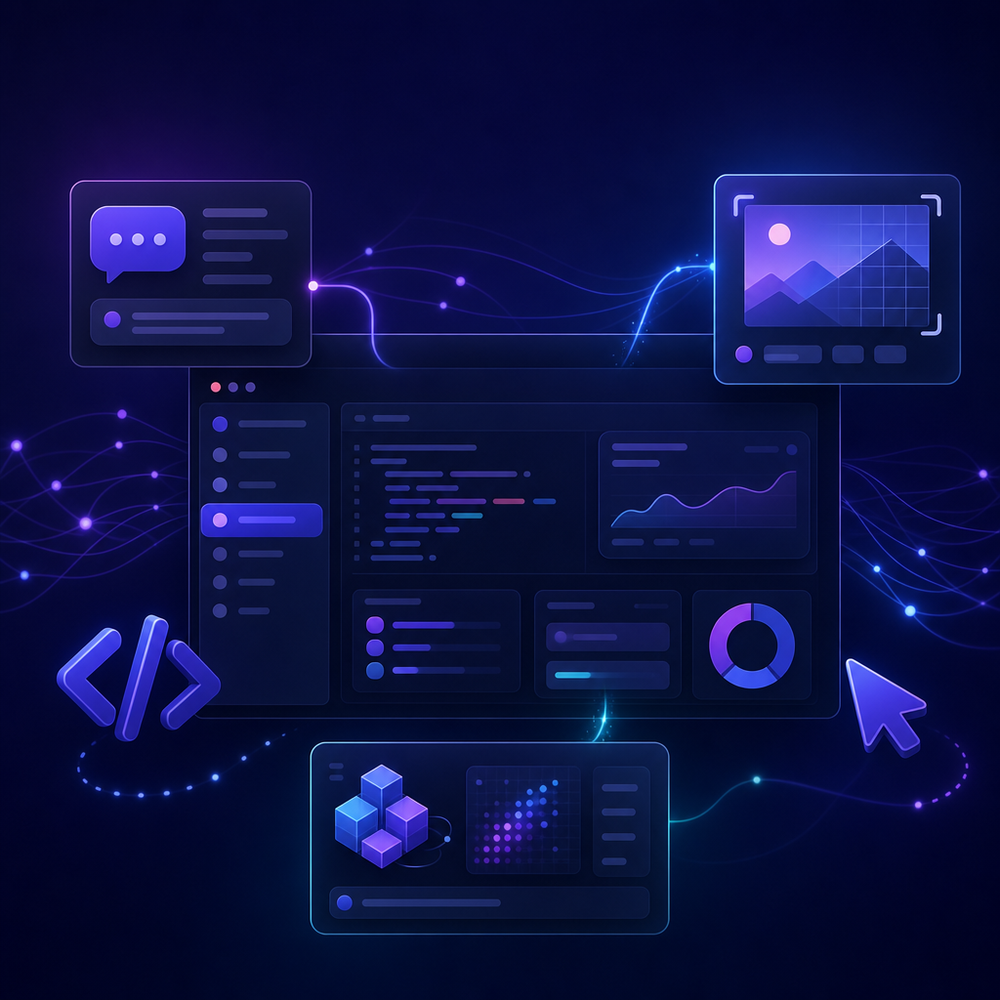

<p align="center">
  
</p>

<h1 align="center">🚀 Aratutec AI Playground</h1>
<p align="center"><strong>Site profissional + playground de IA da Aratutec (Vite · React · TypeScript · Tailwind · shadcn/ui).</strong></p>

<p align="center">
  
  
  
  
  
</p>

---

Landing institucional e playground de experimentos de IA. Construído com Vite + React + TypeScript, estilizado com Tailwind CSS e componentes shadcn/ui.

## 🧰 Stack

- **Vite** + **React 18** + **TypeScript**
- **Tailwind CSS** + **shadcn/ui** (Radix primitives)
- **React Router** · **TanStack Query** · **Recharts**

## 🚀 Quick start

```bash
npm install
npm run dev      # http://localhost:8080
npm run build
npm run lint
```

## 📁 Estrutura

```
src/
├─ pages/          # Index, NotFound
├─ components/ui/  # biblioteca shadcn/ui
└─ lib/            # utils
```
